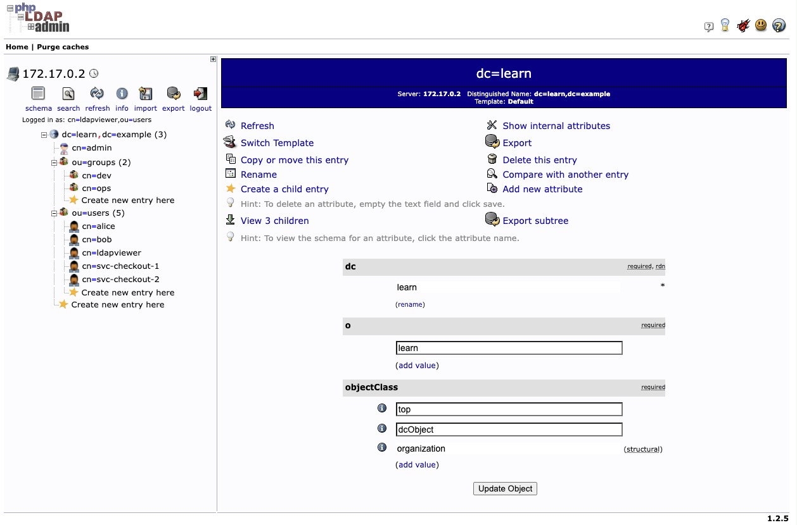
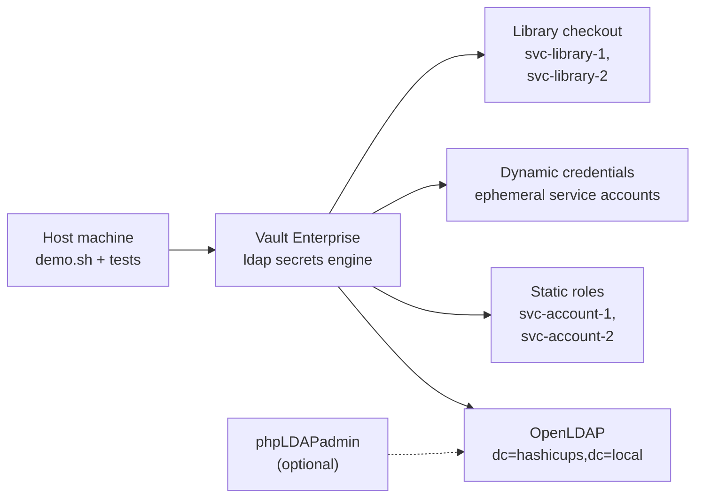
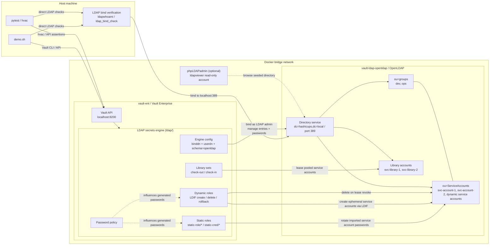

# Vault LDAP Secrets Engine — Full Feature Demo

A comprehensive demonstration of **every feature** of HashiCorp Vault's [LDAP Secrets Engine](https://developer.hashicorp.com/vault/docs/secrets/ldap), built for customer presentations and SE enablement. Uses OpenLDAP in Docker alongside an existing Vault Enterprise cluster.

---

## Features Demonstrated

| # | Feature Area | What's Covered |
|---|---|---|
| 1 | **Engine Setup & Configuration** | Enable engine, configure OpenLDAP connection, verify config |
| 2 | **Root Credential Rotation** | Manual rotation, scheduled rotation (Enterprise), disable/re-enable auto-rotation |
| 3 | **Static Roles** | CRUD operations, credential read, LDAP bind verification, manual rotation, auto-rotation with `rotation_period`, `skip_import_rotation` |
| 4 | **Dynamic Credentials** | LDIF-based role creation, credential generation, lease revocation with LDAP cleanup, custom `username_template`, TTL configuration |
| 5 | **Service Account Library** | Library set CRUD, check-out/check-in, managed (forced) check-in, pool exhaustion behavior |
| 6 | **Hierarchical Paths** | Multi-level role organization (`org/dev`, `org/platform/sre`), listing at each level |
| 7 | **Custom Password Policies** | Policy creation, engine-level application, verification against static and dynamic roles |

---

## Project Structure

```
vault-ldap-se/
├── demo.sh                              # Interactive customer demo script
├── run_tests.sh                         # Pytest runner with state reset
├── cleanup.sh                           # Tear down all resources
├── requirements.txt                     # Python dependencies
├── setup/
│   ├── 00_openldap_setup.sh             # OpenLDAP Docker container + data
│   ├── 01_vault_policy_setup.sh         # Vault admin policy & token
│   ├── 02_ldap_engine_config.sh         # Enable & configure LDAP engine
│   ├── ldifs/
│   │   ├── base.ldif                    # Base OUs (service accounts, groups)
│   │   ├── seed_entries.ldif            # svc-account-1, svc-account-2, ldapviewer + dev/ops groups
│   │   ├── library_accounts.ldif        # svc-library-1, svc-library-2
│   │   ├── creation.ldif                # Dynamic role creation template
│   │   ├── deletion.ldif                # Dynamic role deletion template
│   │   └── rollback.ldif                # Dynamic role rollback template
│   └── policies/
│       └── admin-policy.hcl             # Vault policy for demo operations
├── assets/
│   ├── ldap-secrets-engine-block-diagram.mmd  # Simplified Mermaid block diagram
│   ├── ldap-secrets-engine-code-map.html      # Interactive architecture playground
│   ├── ldap-secrets-engine-architecture.mmd # Standalone Mermaid architecture diagram
│   ├── phpldapadmin-demo.png            # Screenshot of phpLDAPadmin browsing the seeded LDAP tree
│   └── vault-ldap-se-demo-recording.webm # Demo recording embedded in this README
└── tests/
    ├── README.md                       # Detailed automated test suite breakdown
    ├── conftest.py                      # Fixtures, LDAP helpers, constants
    ├── test_01_setup.py                 # Engine setup & root rotation
    ├── test_03_static_roles.py          # Static role lifecycle
    ├── test_04_dynamic_creds.py         # Dynamic credentials
    ├── test_05_library.py               # Service account check-out
    ├── test_06_hierarchical.py          # Hierarchical path organization
    └── test_07_password_policy.py       # Custom password policies
```

---

## Prerequisites

| Component | Version | Notes |
|---|---|---|
| Vault Enterprise | v1.21+ | Running in Docker (container: `vault-ent`) |
| Docker | Any recent | For OpenLDAP container |
| Python | 3.9+ | For pytest test suite |
| Vault CLI | v1.21+ | For demo script |

---

## Quick Start

### 1. Set environment variables

```bash
export VAULT_ADDR="http://127.0.0.1:8200"
export VAULT_TOKEN="<your-root-token>"          # Root or admin token
export VAULT_ROOT_TOKEN="<your-root-token>"     # Used by test runner
```

### 2. Install Python dependencies

```bash
pip3 install -r requirements.txt
```

### 3. Run the interactive demo (recommended for customers)

```bash
./demo.sh                    # Interactive — pauses between each section
```
#### Video recording of the demo
<video src="https://github.com/user-attachments/assets/0f3b4990-15e6-4f72-bf2d-e41cabb74a90" controls="controls" style="max-width: 100%;">
</video>

> Note: the embedded video and screenshot assets below were recorded before the `hashicups.local` / `ServiceAccounts` rename. The scripts, tests, LDIFs, and diagrams in this repository reflect the current naming.

#### Optional: launch phpLDAPadmin alongside the demo

```bash
./demo.sh --phpldapadmin --no-cleanup
```

- Open `https://127.0.0.1:6443/`
- Your browser will show a certificate warning because the container uses a self-signed cert
- Log in with:
  - DN: `cn=ldapviewer,ou=ServiceAccounts,dc=hashicups,dc=local`
  - Password: `ldapviewerpassword`
- Use `--no-cleanup` if you want the browser to stay available after the demo ends



### 4. Or run the automated test suite

```bash
# Full setup + tests (from scratch)
bash setup/00_openldap_setup.sh
bash setup/01_vault_policy_setup.sh
bash setup/02_ldap_engine_config.sh
./run_tests.sh

# Just re-run tests (infrastructure already up)
./run_tests.sh
```

---

## Demo Script Usage

The demo script (`demo.sh`) walks through all 7 feature areas with colored output, command display, and optional pause-between-steps for live narration.

```bash
./demo.sh                        # Interactive (pauses for presenter)
./demo.sh --help                 # Show built-in usage help
./demo.sh --auto                 # Non-interactive (runs straight through)
./demo.sh --skip-setup           # Skip infrastructure setup (reuse existing)
./demo.sh --no-cleanup           # Keep all resources after demo
./demo.sh --phpldapadmin         # Start phpLDAPadmin for live LDAP browsing
./demo.sh --phpldapadmin --no-cleanup
./demo.sh --skip-setup --phpldapadmin  # Reuse existing OpenLDAP and start phpLDAPadmin
./demo.sh --auto --no-cleanup    # Quick validation run
```

**Flags:**

| Flag | Effect |
|---|---|
| `-h`, `--help` | Prints built-in usage instructions and exits before checking Vault environment variables |
| `--auto` | Disables pause prompts — runs all sections continuously |
| `--skip-setup` | Skips Section 0 (OpenLDAP container creation, LDAP population, engine configuration). Assumes infrastructure is already running. |
| `--no-cleanup` | Preserves all resources (containers, roles, engine) after the demo finishes. Useful for post-demo exploration. |
| `--phpldapadmin` | Starts `osixia/phpldapadmin` and prints the browser URL plus dedicated read-only credentials. Works with or without `--skip-setup`. By default it listens on `https://127.0.0.1:6443/` and honors `PHPLDAPADMIN_PORT` if set. |

**Output**: Each section shows the Vault/LDAP commands being executed, their output, and a pass/fail summary table at the end.

### phpLDAPadmin Notes

- The demo uses a dedicated read-only browser account: `cn=ldapviewer,ou=ServiceAccounts,dc=hashicups,dc=local`
- The browser account is intentionally separate from the LDAP admin account because Vault rotates the admin password during the demo
- On Docker's default `bridge` network, phpLDAPadmin is configured to connect to OpenLDAP by container IP rather than container name
- If you use `--no-cleanup`, the seeded service accounts and library accounts remain present in LDAP for post-demo inspection

---

## Test Suite

The automated suite covers **40 tests** across 7 files. Tests use `pytest` with the `hvac` Python client and verify both Vault API behavior and the live OpenLDAP directory.

For the full per-file breakdown, see [`tests/README.md`](./tests/README.md).

Coverage areas include:

- Engine setup and root rotation
- Static roles and password rotation
- Dynamic credentials and lease revocation cleanup
- Service account library check-out/check-in
- Hierarchical paths
- Password policies

---

## Architecture

> This demo uses the Vault LDAP **Secrets Engine**. It does **not** configure Vault's LDAP **auth method**.

### Simplified block diagram



### Detailed architecture



- **Host tools** call Vault at `localhost:8200`
- **Vault's `ldap/` secrets engine** connects to OpenLDAP over the Docker bridge network
- **Tests and demo steps** also verify credentials by binding directly to LDAP at `localhost:389`
- **Static roles** rotate passwords for imported LDAP service accounts, **dynamic roles** create and delete ephemeral service accounts from LDIF templates, and **library sets** lease pooled service accounts
- **Engine-level password policy** influences generated passwords for static and dynamic credentials
- **phpLDAPadmin** is optional and uses the dedicated `ldapviewer` account for read-only browsing
- Simplified block diagram source: `assets/ldap-secrets-engine-block-diagram.mmd`
- Standalone Mermaid source: `assets/ldap-secrets-engine-architecture.mmd`
- Interactive architecture playground: `assets/ldap-secrets-engine-code-map.html` (open locally in a browser)
- After root rotation, admin LDAP maintenance in tests uses **SASL EXTERNAL** (`docker exec ... -Y EXTERNAL -H ldapi:///`) to avoid depending on the rotated password

---

## LDAP Directory Layout

```
dc=hashicups,dc=local
├── ou=ServiceAccounts
│   ├── cn=svc-account-1    (member of: dev)
│   ├── cn=svc-account-2    (member of: dev, ops)
│   ├── cn=ldapviewer       (read-only phpLDAPadmin browser account)
│   ├── cn=svc-library-1    (library service account)
│   └── cn=svc-library-2    (library service account)
└── ou=groups
    ├── cn=dev             (members: svc-account-1, svc-account-2)
    └── cn=ops             (member: svc-account-2)
```

Dynamic credentials are created under `ou=ServiceAccounts` as ephemeral service accounts and cleaned up on lease revocation via the deletion LDIF template.

---

## Technical Notes

### OpenLDAP rootDN Password Behavior

The `cn=admin,dc=hashicups,dc=local` is OpenLDAP's **rootDN**. Its authentication password is stored as `olcRootPW` in the config database (`cn=config`), **not** as `userPassword` on the entry itself. Vault's `rotate-root` modifies `userPassword`, which does not affect rootDN authentication. This is expected OpenLDAP behavior — for production, use a non-rootDN service account as the bind DN.

### SASL EXTERNAL Authentication

After root rotation, the original admin password may still work for rootDN (see above). To avoid ambiguity, all administrative LDAP operations in the test suite use SASL EXTERNAL authentication via:

```bash
docker exec vault-ldap-openldap ldapmodify -Y EXTERNAL -H ldapi:///
```

This authenticates via Unix socket credentials (root inside the container) and requires no password.

### phpLDAPadmin Browser Account

The optional phpLDAPadmin flow seeds a dedicated account:

```text
cn=ldapviewer,ou=ServiceAccounts,dc=hashicups,dc=local
```

This account is granted read-only ACLs on the LDAP tree so it can browse entries in the UI without depending on the admin bind DN, whose password is rotated by Vault during the demo.

### Dynamic Credential LDIF Templates

Dynamic roles use Go template syntax in base64-encoded LDIF:

```ldif
# creation.ldif
dn: cn={{.Username}},ou=ServiceAccounts,dc=hashicups,dc=local
objectClass: inetOrgPerson
cn: {{.Username}}
sn: {{.Username}}
userPassword: {{.Password}}
```

Vault processes the templates at credential generation time, creating real LDAP entries. On lease revocation, the deletion template removes the entry.

### Vault Policy Requirements

The `sys/mounts` path (exact) must be included separately from `sys/mounts/*` (wildcard). The wildcard does **not** match the exact path — both are needed for listing mounted engines and managing specific mounts.

---

## Cleanup

```bash
./cleanup.sh
```

This removes:
- OpenLDAP Docker container (`vault-ldap-openldap`)
- phpLDAPadmin Docker container (`vault-ldap-phpldapadmin`)
- LDAP secrets engine (`ldap/`)
- Vault policies (`ldap-admin`)
- Password policies created during the demo

Before disabling the LDAP secrets engine, `cleanup.sh` force-revokes outstanding `ldap/*` leases. This makes cleanup reliable even when there are dangling dynamic or library leases and the OpenLDAP backend has already been removed.

---

## References

- [LDAP Secrets Engine Documentation](https://developer.hashicorp.com/vault/docs/secrets/ldap)
- [LDAP Secrets Engine API](https://developer.hashicorp.com/vault/api-docs/secret/ldap)
- [Tutorial: Static Password Rotation with OpenLDAP](https://developer.hashicorp.com/vault/tutorials/secrets-management/openldap)
