# Shared OpenLDAP service account management with Vault namespaces

*A Strategic Guide to Optimizing LDAP Secrets Engine Design that aligns with your organizational boundaries*

## Challenge

LDAP service accounts are managed centrally, but the users and applications that want to consume those accounts live across many tenant namespaces in HashiCorp Vault. The primary design question then is: Should each tenant namespace run its own LDAP secrets engine configuration, or should LDAP secrets engine access be managed centrally and shared safely across namespaces? If you place one LDAP secrets engine mount in every tenant namespace, you duplicate connection configuration, delegated administration, role naming, and ongoing operational ownership for the same backend directory service. That model becomes harder to govern as teams scale and makes it harder to apply a consistent operating model across the organization.

## Solution

An optimal solution is to keep LDAP secrets engine management in a shared administrative namespace rather than duplicating mounts into every tenant namespace. In the scenario illustrated in this document, that shared boundary is a central namespace, while workloads and users continue to authenticate in their own tenant namespaces. Users in tenant namespaces consume approved LDAP roles from the shared namespace by using a [cross-namespace access](https://developer.hashicorp.com/vault/tutorials/enterprise/namespaces-secrets-sharing) mechanism.

This document explains an optimal solution, not a HashiCorp validated pattern. It describes the proposed operating model and technical shape for specific scenarios.

## Comparing placement models for the LDAP secrets engine

This decision is not a strict binary between "everything in the central namespace" and "everything local to each tenant." In practice, there are three common patterns:

1. Central shared namespace mounts. We'll refer to the central namespace as `ns-central`
2. Business-unit-shared mounts in a business-unit namespace that several sub-teams share
3. Fully local tenant mounts in each tenant namespace

| Criterion | Central shared namespace mounts (`ns-central`) | Business-unit-shared mounts | Fully local tenant mounts |
|---|---|---|---|
| Day 1 implementation | Lowest initial build effort when the platform team already owns service account lifecycle and directory integration | Moderate setup per business unit, but still avoids one mount per tenant | Highest setup cost because each tenant repeats mount, policy, and bind DN configuration |
| Day 2 operations | Strong operating efficiency because rotation, standardization, upgrades, and policy guardrails are centrally managed once per directory boundary | Balanced; each business unit operates its own shared mounts, with some duplication across units | Highest ongoing cost because upgrades, rotation settings, and hygiene must be repeated everywhere |
| Security / blast radius | Largest shared blast radius if the shared namespace is misconfigured, but also the easiest place to apply uniform controls | Smaller blast radius than fully central because impact is contained to one business unit boundary | Smallest local blast radius, but the greatest risk of uneven controls and drift across tenants |
| Bind DN management / delegated administration | Centralized and simplest to govern; delegated bind account ownership is managed once per directory boundary | Delegated bind account ownership aligns to the business unit that already owns that directory boundary | Most distributed; each bind account and LDAP configuration must be managed separately and safely|
| Cross-namespace access complexity | Highest, because tenant identities must map cleanly into shared access in `ns-central` | Moderate, usually limited to sub-teams within one business unit | Lowest, because consumers stay local to their own namespace |
| Governance / policy consistency | Strongest consistency across teams, policies, naming, and onboarding workflows | Strong within the business unit, with some variation across units | Weakest consistency unless heavily automated and reviewed |
| Consumer autonomy / speed | Lower than local models because teams depend on the central service workflow | Better responsiveness for sub-teams that share the same operating model | Highest local autonomy and fastest tenant-level change velocity |
| Observability / auditability | Strong centralized audit trail and easier fleet-wide reporting | Good auditability per business unit, with clearer attribution than a single global shared namespace | Audit trails are local and easy to attribute, but harder to roll up consistently across the organization |

When a **central shared namespace** is the best fit:

- service account management is already run as a platform service
- the same team owns the delegated bind account model, Vault-managed OU standards, and onboarding workflow
- most tenants are consumers, not administrators, of LDAP-backed service accounts
- consistency, policy hygiene, and centralized reporting matter more than tenant-by-tenant independence

When a **business-unit namespace** is the better shared boundary:

- a business unit already owns its own directory boundary, delegated bind account, and operational approvals
- multiple sub-teams need the same service, but they do not need a global `ns-central` dependency for every change
- the organization wants shared mounts, but at a boundary smaller than the whole enterprise

When **fully local tenant mounts** are justified:

- a tenant has materially different operational, regulatory, or lifecycle requirements
- the tenant genuinely owns its LDAP integration end to end, whether directly or through clearly owned on-behalf-of automation, including delegated administration and day 2 support
- reducing cross-namespace access is more important than maintaining a shared platform operating model

The decision framework is simple: the right placement boundary is the **ownership and administrative boundary**, not automatically the root central namespace. If service account lifecycle, delegated bind account management, and directory governance are centrally owned, use `ns-central`. If those responsibilities are shared at a business-unit boundary, host the shared mounts there. Only use fully local tenant mounts when the tenant truly owns the backend and the ongoing operational burden is justified.

## Proposed architecture

Given that customers typically have centralized ownership of service account lifecycle, delegated administration, and onboarding, this document focuses on the **central shared namespace** architecture pattern. The proposed architecture below therefore uses that model as the worked example, rather than the business-unit-shared or fully local tenant patterns.

To make the example concrete, the rest of this section uses two sample business units, `engineering` and `sharedservices`, to drill down on the architecture. They are illustrative examples that show how shared mounts, tenant namespaces, naming contexts, and delegated bind accounts line up in practice.

- Shared namespace: `ns-central`

- Shared LDAP mounts in `ns-central`: `ldap-engineering/` and `ldap-sharedservices/`

- Sample engineering tenant namespaces: `ns-engineering-1` and `ns-engineering-2`, both consuming `ldap-engineering/`

- Sample shared-services tenant namespaces: `ns-shared-services-1` and `ns-shared-services-2`, both consuming `ldap-sharedservices/`

- One OpenLDAP deployment with two sample naming contexts: `dc=engineering,dc=hashicups,dc=local` and `dc=sharedservices,dc=hashicups,dc=local`

Within each naming context, Vault-managed service accounts live under a dedicated Vault-managed OU:

- `ou=vault,ou=ServiceAccounts,dc=engineering,dc=hashicups,dc=local`
- `ou=vault,ou=ServiceAccounts,dc=sharedservices,dc=hashicups,dc=local`

Each LDAP mount uses a delegated bind account that lives in a separate admin-style OU:

- `cn=vault-bind,ou=delegated-admin,dc=engineering,dc=hashicups,dc=local`
- `cn=vault-bind,ou=delegated-admin,dc=sharedservices,dc=hashicups,dc=local`

Those bind accounts should have password change and reset rights only on the corresponding Vault-managed OU, not across the whole directory.

Cluster-level namespace administration and global features may still be managed from the root namespace, but the shared LDAP mounts, entity groups, and policies in this design live in `ns-central`.

The example intentionally uses two shared mounts, not one mount per tenant. Mount count should follow directory ownership and shared administration, not raw namespace count.

## Architecture diagram

The following diagram summarizes the proposed shared-namespace model.

```mermaid
%%{init: {'flowchart': {'nodeSpacing': 55, 'rankSpacing': 70}} }%%
%% Shared OpenLDAP service account management across Vault namespaces.
%% Solid arrows show the main request path. Dotted arrows show delegated administration boundaries.
flowchart LR
  classDef control fill:#E8F0FE,stroke:#1A73E8,stroke-width:2px,color:#0B1F33;
  classDef shared fill:#E6F4EA,stroke:#137333,stroke-width:3px,color:#0B1F33;
  classDef tenant fill:#FFF4E5,stroke:#B06000,stroke-width:2px,color:#0B1F33;
  classDef ldap fill:#F3E8FD,stroke:#7E57C2,stroke-width:2px,color:#0B1F33;
  classDef actor fill:#FCE8E6,stroke:#D93025,stroke-width:2px,color:#0B1F33;
  classDef note fill:#FFF8C5,stroke:#8D6E00,stroke-width:2px,color:#0B1F33;

  eng1Actor["Engineering apps/users"]
  eng2Actor["Engineering apps/users"]
  svc1Actor["Shared services apps/users"]
  svc2Actor["Shared services apps/users"]
  vaultAdminActor["Vault admins and pipelines"]

  subgraph vault["**Vault Enterprise Cluster**"]
    direction TB
    root["Admin control plane<br/>shared mount configuration"]
    gpamode["**Cross-namespace access**<br/>group_policy_application_mode=any"]
    root --> gpamode


    subgraph engTenants["**Engineering namespaces**"]
      direction LR
      subgraph nsEng1["ns-engineering-1"]
        direction TB
        eng1Auth["Auth methods"]
        eng1Alias["Entity alias"]
        eng1Auth --> eng1Alias
      end
      subgraph nsEng2["ns-engineering-2"]
        direction TB
        eng2Auth["Auth methods"]
        eng2Alias["Entity alias"]
        eng2Auth --> eng2Alias
      end
    end

    subgraph svcTenants["**Shared services namespaces**"]
      direction LR
      subgraph nsSvc1["ns-shared-services-1"]
        direction TB
        svc1Auth["Auth methods"]
        svc1Alias["Entity alias"]
        svc1Auth --> svc1Alias
      end
      subgraph nsSvc2["ns-shared-services-2"]
        direction TB
        svc2Auth["Auth methods"]
        svc2Alias["Entity alias"]
        svc2Auth --> svc2Alias
      end
    end

    subgraph ldapShared["**Shared namespace: ns-central**"]
      direction TB
      engGroup["**Engineering entity group**<br/>policy grants on ldap-engineering/"]
      svcGroup["**Shared services entity group**<br/>policy grants on ldap-sharedservices/"]
      ldapEng["ldap-engineering/"]
      ldapSvc["ldap-sharedservices/"]
      rolePattern["**Hierarchical role pattern**<br/>&lt;namespace&gt;/&lt;team&gt;/&lt;app&gt;/&lt;role-type&gt;/&lt;role-name&gt;"]
      examplePath["**Example static role**<br/>ldap-engineering/static-role/ns-engineering-1/team1/app1/static/svc-account-1"]

      rolePattern -.-> examplePath
      rolePattern -.-> ldapEng
      rolePattern -.-> ldapSvc
      engGroup --> ldapEng
      svcGroup --> ldapSvc
    end
  end

  subgraph openldap["**OpenLDAP deployment**"]
    direction LR
    ldapEndpoint["OpenLDAP endpoint<br/>ldaps://openldap.hashicups.local:636"]

    subgraph engDir["**Engineering directory**<br/>dc=engineering,dc=hashicups,dc=local"]
      direction TB
      engDelegatedOu["cn=vault-bind,ou=delegated-admin"]
      engVaultOu["ou=vault, ou=ServiceAccounts"]
      engDelegatedOu -. "change/reset rights only" .-> engVaultOu
    end

    subgraph svcDir["**Shared services directory**<br/>dc=sharedservices,dc=hashicups,dc=local"]
      direction TB
      svcDelegatedOu["cn=vault-bind,ou=delegated-admin"]
      svcVaultOu["ou=vault, ou=ServiceAccounts"]
      svcDelegatedOu -. "change/reset rights only" .-> svcVaultOu
    end

    ldapEndpoint --> engDir
    ldapEndpoint --> svcDir
  end

  eng1Actor -->|"authenticates to namespace"| eng1Auth
  eng2Actor -->|"authenticates to namespace"| eng2Auth
  svc1Actor -->|"authenticates to namespace"| svc1Auth
  svc2Actor -->|"authenticates to namespace"| svc2Auth
  vaultAdminActor -->|"authenticates to root namespace"| root
  
  gpamode --> ldapShared

  eng1Alias -->|"maps into"| engGroup
  eng2Alias -->|"maps into"| engGroup
  svc1Alias -->|"maps into"| svcGroup
  svc2Alias -->|"maps into"| svcGroup

  ldapSvc -->|"uses shared endpoint"| ldapEndpoint
  ldapEng -->|"uses shared endpoint"| ldapEndpoint

  ldapEng -. "binds as cn=vault-bind" .-> engDelegatedOu
  ldapSvc -. "binds as cn=vault-bind" .-> svcDelegatedOu

  class root,gpamode,engGroup,svcGroup,vaultAdminActor control;
  class ldapEng,ldapSvc shared;
  class rolePattern,examplePath note;
  class eng1Auth,eng1Alias,eng2Auth,eng2Alias,svc1Auth,svc1Alias,svc2Auth,svc2Alias tenant;
  class ldapEndpoint,engDelegatedOu,engVaultOu,svcDelegatedOu,svcVaultOu ldap;
  class eng1Actor,eng2Actor,svc1Actor,svc2Actor actor;
```



## Why a shared administrative boundary is the right default

The customer already has a centralized operating model for service account management. The same principle should apply inside Vault.

You should start with shared LDAP secrets engine mounts rather than tenant-local mounts because:

- the LDAP connection configuration is shared infrastructure, not tenant-local configuration
- service account lifecycle is centrally owned
- the Vault team can govern mount creation, bind credentials, password policies, and rotation behavior consistently
- tenant consumers can stay isolated at the namespace level without inheriting responsibility for LDAP backend administration

In this specific scenario, that shared administrative boundary is `ns-central`. In other environments, that same logic may point to a business-unit namespace instead. The goal is not “one mount per tenant namespace.” The goal is “one shared mount per real administrative boundary.” That is why multiple engineering namespaces consume `ldap-engineering/`, and multiple shared-services namespaces consume `ldap-sharedservices/`.

## How entity aliases in tenant namespaces map to shared access in `ns-central`

The primary cross-namespace mechanism is still `group_policy_application_mode=any`, but the runtime flow is easier to understand when you describe the identity path explicitly.

The request flow can be summarized as follows:

1. An app or user authenticates to the auth method in its own namespace, for example `ns-engineering-1`.
2. That auth flow resolves or creates an entity alias for the caller in the tenant namespace.
3. The entity alias maps to an entity group in `ns-central`.
4. The entity group in `ns-central` carries the shared access policy for the appropriate LDAP mount and role paths.
5. The caller requests service account credentials from the shared namespace.
6. Because `group_policy_application_mode=any` is enabled, the token issued in the tenant namespace can use the shared group policy when calling the shared LDAP mount.
7. The shared LDAP mount manages the service accounts in OpenLDAP through the delegated bind account and the Vault-managed OU.

The important thing is that the tenant-side identity resolves into shared authorization owned in `ns-central`. For example, an engineering caller might read `ldap-engineering/static-cred/ns-engineering-1/team1/app1/static/svc-account-1` once its tenant identity resolves into the shared engineering group.

## OpenLDAP directory layout and delegated administration

The OpenLDAP layout should make a clear separation between:

- the OU where Vault-managed service accounts live
- the OU where the delegated bind account lives

For engineering:

- Vault-managed accounts:
  - `ou=vault,ou=ServiceAccounts,dc=engineering,dc=hashicups,dc=local`
- Delegated bind account location:
  - `cn=vault-bind,ou=delegated-admin,dc=engineering,dc=hashicups,dc=local`

For shared services:

- Vault-managed accounts:
  - `ou=vault,ou=ServiceAccounts,dc=sharedservices,dc=hashicups,dc=local`
- Delegated bind account location:
  - `cn=vault-bind,ou=delegated-admin,dc=sharedservices,dc=hashicups,dc=local`

This separation matters operationally.

You do not want the bind account to sit alongside the service accounts that Vault is rotating and issuing. You want a clearly distinct administrative identity whose permissions are scoped only to the OU that Vault manages. That gives you a simpler control boundary and a cleaner story for least privilege.

This architecture also has a few design implications for the LDAP secrets engine configuration:

- each mount uses `schema="openldap"`
- transport is protected with `ldaps://` or `starttls=true`
- each mount targets the correct naming context
- `userdn` stays scoped to the Vault-managed OU under `ou=vault,ou=ServiceAccounts,...`
- the bind DN stays delegated and narrowly privileged
- once a mount is configured, Vault should rotate the bind DN credential with `rotate-root` so that only Vault knows the password

## Hierarchical paths convention for roles on the shared mounts

Each shared mount should use hierarchical paths for role names so that one mount can safely serve several tenant namespaces and several teams within those namespaces.

For example, use a naming pattern like:

```text
<namespace>/<team>/<app>/<role-type>/<role-name>
```

Use these conventions consistently:

- `<namespace>` uses the full namespace name, including the `ns-` prefix
- `<team>` uses generic placeholders such as `team1`, `team2`
- `<app>` uses generic placeholders such as `app1`, `app2`
- `<role-type>` uses `static`, `library`, `dynamic`
- `<role-name>` uses:
  - the service account name for `static`
  - the pool or library-set name for `library`
  - the dynamic role name for `dynamic`

This gives you one naming model that works across all role families without the need for per-tenant mounts. Additionally, this hierarchical structure allows you to structure granular policies (e.g. per app, per role) or broader policies (e.g. per team, per namespace).

### Example role paths

The API prefix differs by role family, but the hierarchical name stays consistent. The examples below are representative rather than exhaustive.

| Consumer namespace | Mount path | Static role | Library set | Dynamic role |
|---|---|---|---|---|
| `ns-engineering-1` | `ldap-engineering/` | `ldap-engineering/static-role/ns-engineering-1/team1/app1/static/svc-account-1` | `ldap-engineering/library/ns-engineering-1/team1/app1/library/pool1` | `ldap-engineering/role/ns-engineering-1/team1/app1/dynamic/dynrole1` |
| `ns-shared-services-1` | `ldap-sharedservices/` | `ldap-sharedservices/static-role/ns-shared-services-1/team1/app1/static/svc-account-1` | `ldap-sharedservices/library/ns-shared-services-1/team1/app1/library/pool1` | `ldap-sharedservices/role/ns-shared-services-1/team1/app1/dynamic/dynrole1` |

## When to use static, library, and dynamic roles

All three role families are useful in this design.

### Static roles

Use static roles when an integration uses an existing named service account and Vault should rotate its password over time.

This is the best fit for:

- legacy integrations
- middleware platforms with fixed account expectations
- long-lived service account patterns where a stable identity is required but password rotation is a requirement

#### Considerations
> For existing service accounts, do not move a production account into a Vault-managed OU just to enable rotation. Changing the distinguished name can break scripts, ACL references, and application configuration. The safer migration pattern is replacement and cutover: create a new equivalent account in the Vault-managed OU, onboard it into Vault rotation, migrate consumers to it, and then retire the old account.

### Library sets

Use library sets when operators need controlled checkout and return semantics for shared accounts.

This is the best fit for:

- human-operated support workflows
- limited-time privileged access
- pooled operational accounts that should not be shared manually outside Vault

### Dynamic roles

Use dynamic roles when you want short-lived, bounded access patterns and the workload can tolerate ephemeral identities.

This is the best fit for:

- automation jobs
- temporary operational workflows
- time-boxed access where automatic cleanup is desirable

The key point is that all three role families can live under the same shared mount as long as the naming convention stays consistent and access policies stay narrow.

## Ownership and onboarding model

The Vault team owns the shared service boundary shown in this design.

That means the Vault team owns:

- the `ns-central` namespace
- the shared LDAP mounts
- shared access policies
- tenant configuration management
- onboarding changes through Terraform and CI/CD workflows
- the role naming standard
- the mount-to-directory mapping

In this model, onboarding is not an ad hoc UI exercise. The Vault team manages namespace configuration and shared LDAP access patterns through code and promotion workflows. That keeps the operating model consistent with the customer's centralized service account management approach.

Tenant teams remain consumers of the service. They request onboarding and approved access, but they do not own the shared LDAP backend configuration in this model.

## Risks and considerations

A few operational considerations are worth calling out:

- `group_policy_application_mode=any` is cluster-wide and should be reviewed deliberately
- hierarchical naming only helps if the team enforces it consistently, automation is recommended.
- the delegated bind account must stay narrowly privileged to the Vault-managed OU
- the shared namespace model works only if ownership is explicit and centralized

## Related resources

- [Vault LDAP secrets engine documentation](https://developer.hashicorp.com/vault/docs/secrets/ldap)
- [LDAP hierarchical paths documentation](https://developer.hashicorp.com/vault/docs/secrets/ldap#hierarchical-paths)
- [Vault namespace structuring guidance](https://developer.hashicorp.com/vault/tutorials/enterprise/namespace-structure)
- [Configure cross-namespace access with group policy application](https://developer.hashicorp.com/vault/docs/enterprise/namespaces/configure-cross-namespace-access)

## Conclusion

This solution keeps the LDAP backend shared and governed at the right administrative boundary, while still letting multiple tenant namespaces consume the service cleanly. The broader point is more durable than the example - many namespaces can consume one shared LDAP mount when the directory boundary, delegated administration model, identity mapping, and hierarchical naming convention are designed well, and when the mount placement follows actual ownership instead of namespace count alone.
